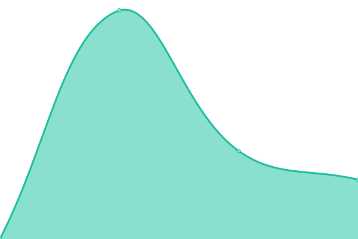

# [📈 Live Status](https://la-test.github.io/sbx-upptime): <!--live status--> **🟩 All systems operational**

This repository contains the open-source uptime monitor and status page for [la-test](https://la-test.github.io/sbx-upptime), powered by [Upptime](https://github.com/upptime/upptime).

With [Upptime](https://upptime.js.org), you can get your own unlimited and free uptime monitor and status page, powered entirely by a GitHub repository. We use [Issues](https://github.com/la-test/sbx-upptime/issues) as incident reports, [Actions](https://github.com/la-test/sbx-upptime/actions) as uptime monitors, and [Pages](https://la-test.github.io/sbx-upptime) for the status page.

<!--start: status pages-->
<!-- This summary is generated by Upptime (https://github.com/upptime/upptime) -->
<!-- Do not edit this manually, your changes will be overwritten -->
<!-- prettier-ignore -->
| URL | Status | History | Response Time | Uptime |
| --- | ------ | ------- | ------------- | ------ |
|  [Least Authority](https://www.leastauthority.com/) | 🟩 Up | [least-authority.yml](https://github.com/la-test/sbx-upptime/commits/HEAD/history/least-authority.yml) | 

 0ms
     
 | 

<a href="https://la-test.github.io/sbx-upptime/history/least-authority">100.00%</a>
    

|  [Private Storage](https://private.storage/) | 🟩 Up | [private-storage.yml](https://github.com/la-test/sbx-upptime/commits/HEAD/history/private-storage.yml) | 

 0ms
     
 | 

<a href="https://la-test.github.io/sbx-upptime/history/private-storage">100.00%</a>
    

|  [Winden](https://winden.app/) | 🟩 Up | [winden.yml](https://github.com/la-test/sbx-upptime/commits/HEAD/history/winden.yml) | 

 0ms
     
 | 

<a href="https://la-test.github.io/sbx-upptime/history/winden">100.00%</a>
    

|  [HRO Cloud](https://thissitedoesnotexist.koj.co) | 🟩 Up | [hro-cloud.yml](https://github.com/la-test/sbx-upptime/commits/HEAD/history/hro-cloud.yml) | 

 0ms
     
 | 

<a href="https://la-test.github.io/sbx-upptime/history/hro-cloud">0.00%</a>
    

<!--end: status pages-->

[**Visit our status website →**](https://la-test.github.io/sbx-upptime)

## 📄 License

- Powered by: [Upptime](https://github.com/upptime/upptime)
- Code: [MIT](./LICENSE) © [la-test](https://la-test.github.io/sbx-upptime)
- Data in the `./history` directory: [Open Database License](https://opendatacommons.org/licenses/odbl/1-0/)
